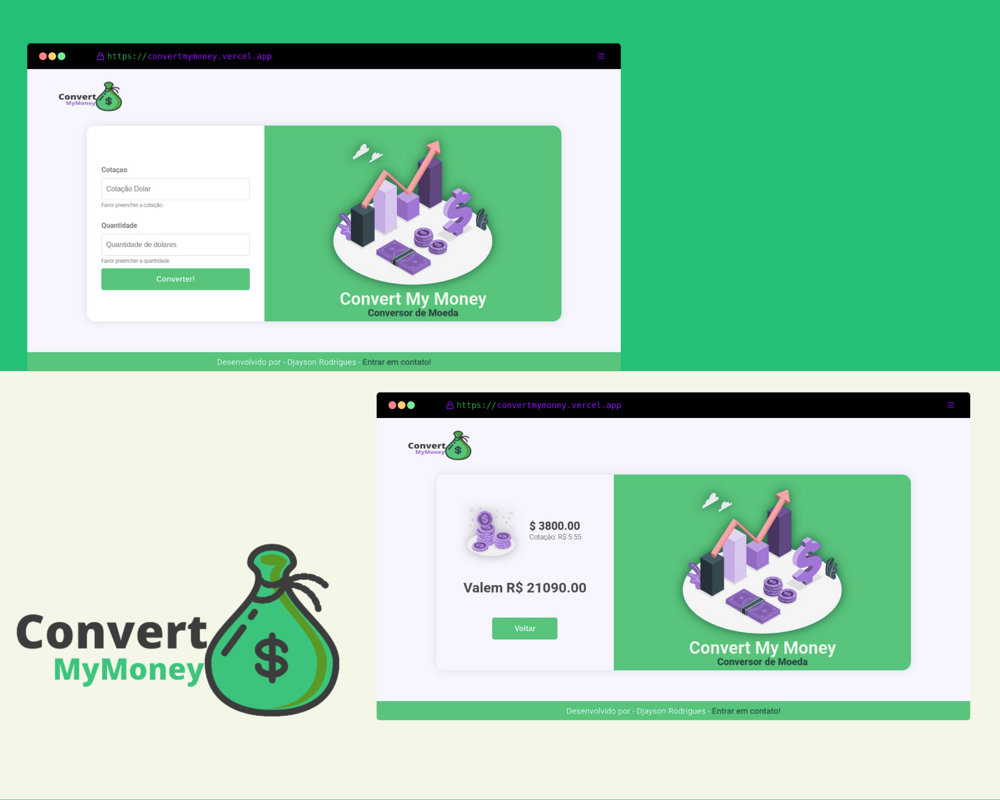

<h1 align="center">
    
    <br>Convert My Money<br/>
</h1>

## 💻 Projeto

O projeto **Convert My Money** é um aplicação Web que consiste em converter Dolar em Reais de acordo com sua cotação de venda atual do dia.

<h1 align="center">
    
</h1>

## 🧑‍💻 Forma de obteção da cotação do Dollar

A forma de obter a cotação do Dollar foi utilizando a API do **Banco Central do Brasil**

- [Site da API](https://dadosabertos.bcb.gov.br/dataset/dolar-americano-usd-todos-os-boletins-diarios/resource/ae69aa94-4194-45a6-8bae-12904af7e176)

## 🚀 Tecnologias

- Node
- Express
- JavaScript
- EJS
- Css
- Jest
- Axios

## ℹ️ Como Executar

- ### **Pré-requisitos**

  - É **necessário** possuir o **[Node.js](https://nodejs.org/en/)** instalado no computador
  - É **necessário** possuir o **[Git](https://git-scm.com/)** instalado e configurado no computador
  - Também, é **preciso** ter um gerenciador de pacotes seja o **[NPM](https://www.npmjs.com/)** ou **[Yarn](https://yarnpkg.com/)**.

1. Faça um clone do repositório:

```sh
  $ git clone https://github.com/Djaysson/ConvertMyMoney.git
```

2. Executando a Aplicação:

```sh
  # Vá para o repositório
  $ cd ConvertMyMoney

  # Instalando as dependências do projeto.
  $ yarn install # ou npm install

  # Execute o app
  $ yarn start # ou npm start
```

Desenvolvido por Djayson Rodrigues 👋 [Entrar em contato!](https://www.linkedin.com/in/djaysonrodrigues/)

## License

[MIT](./LICENSE)
