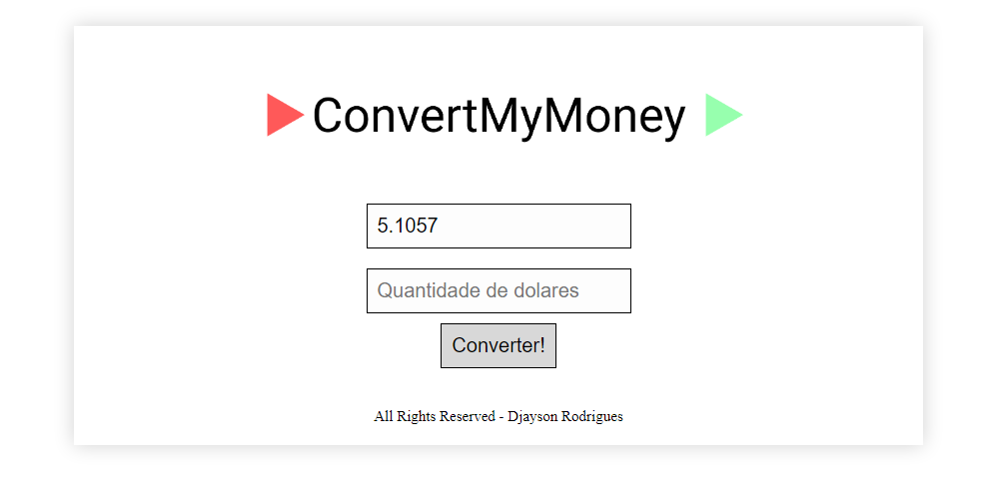

<p align="center"></img>
<h1 align="center">Convert My Money</h1>
<p align="center">O projeto foi desenvolvido para converter moeda estrangeira de acordo com sua contação atual do dia</p>


  ## Instalação 
Para instalar as dependências e executar o **ConvertMyMoney** você vai precisa do NodeJS e do NPM instalado em sua máquina, o outro passo é você clona o projeto em seu computador e em seguida execute:
```bash
cd ConvertMyMoney
npm install
node index.js
```


## Autor
**Djayson Rodrigues** - [LinkedIn](https://br.linkedin.com/in/djaysonrodrigues)


## Frontend

</img>
## Licença

[MIT](./LICENSE)
